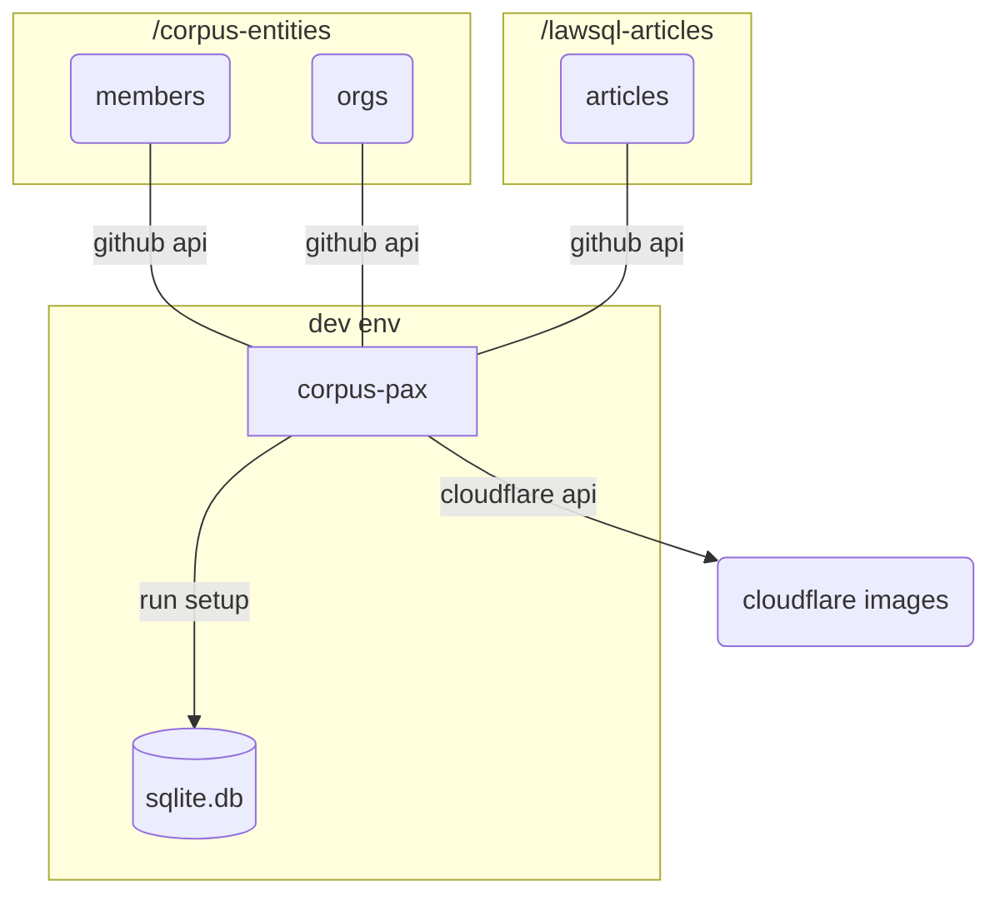

# corpus-pax

Initial, foundational sqlite tables with generic users, organizations, and articles.



## Prerequisites

Repository | Description
--:|:--
[corpus-entities](https://github.com/justmars/corpus-entities) | yaml-formatted member and org files
[lawsql-articles](https://github.com/justmars/lawsql-articles) | markdown-styled articles with frontmatter

Since data concerning members will be pulled from such repositories, make sure the individual / org fields in [resources.py](corpus_pax/resources.py) match the data pulled from `corpus-entities`.

Each avatar image should be named `avatar.jpeg` so that these can be uploaded to Cloudflare.

## Install

```zsh
poetry add corpus-pax
poetry update
```

## Supply .env

Create an .env file to create/populate the database. See [sample .env](.env.example) highlighting the following variables:

1. Cloudflare `CF_ACCT`
2. Cloudflare `CF_TOKEN`
3. Github `GH_TOKEN`
4. `DB_FILE` (sqlite)

Note the [workflow](.github/workflows/main.yml) where the secrets are included for Github actions. Ensure these are set in the repository's `<url-to-repo>/settings/secrets/actions`, making the proper replacements when the tokens for Cloudflare and Github expire.

### Notes

#### Why Github

The names and profiles of individuals and organizations are stored in Github. These are pulled into the application via an API call requiring the use of a personal access token.

#### Why Cloudflare Images

Individuals and organizations have images stored in Github. To persist and optimize images for the web, I use [Cloudflare Images](https://www.cloudflare.com/products/cloudflare-images/) to take advantage of modern image formats and customizable variants.

#### Why sqlite

The initial data is simple. This database however will be the foundation for a more complicated schema. Sqlite seems a better fit for experimentation and future app use (Android and iOS rely on sqlite).

## Steps

Need to specify filename, e.g. ex.db, for this to created in the root directory of the project folder.

Without the filename, the `Connection` (sqlite-utils' Database() under the hood) used is the path declared in $env.DB_FILE

```python
from sqlpyd import Connection  # this is sqlite-utils' Database() under the hood
from corpus_pax import setup

c = Connection(DatabasePath="ex.db", WALMode=False)
setup_pax_db("x.db")
```

## Gotcha

The m2m tables are not corrected when an update is made via `add_individuals_from_api()`, `add_organizations_from_api()` and `add_articles_from_api()`. To alleviate, simply reset the tables and recreate the same from scratch.
